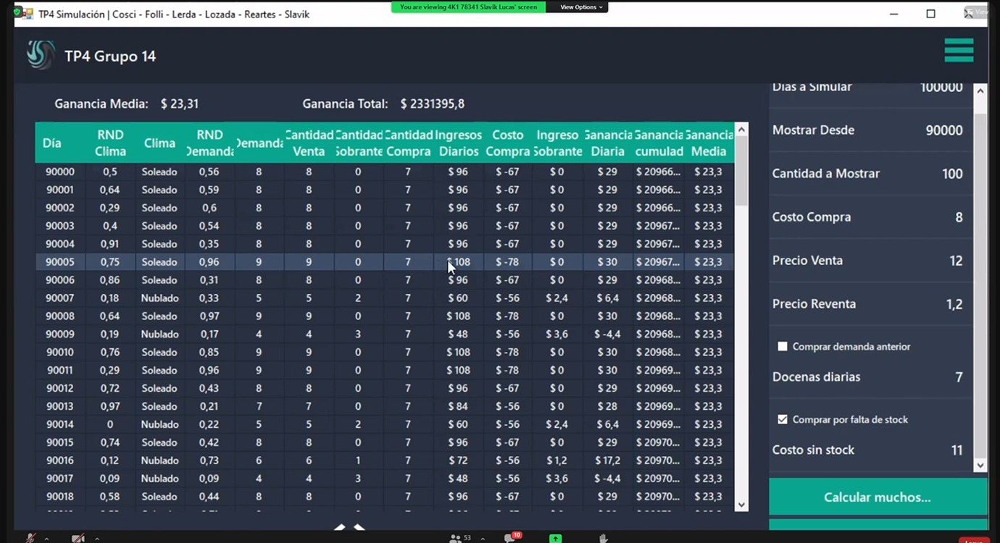

# Para ejecutar  usar el siguiente comanda en la terminar ubicada
npm run dev

Carga de parametros: 
Para el diseño del aplicativo de tu **Trabajo Práctico 4 (Grupo 5)**, los valores que debes cargar por teclado se dividen en parámetros de control de la simulación, parámetros específicos del modelo "i-Fix" y parámetros del generador de números aleatorios. Según la consigna, es obligatorio que todos los valores que aparecen en **rojo** en el enunciado sean configurables por el usuario.

A continuación, detallo los datos que debes incluir en tu interfaz de carga:

### 1. Parámetros de Control de la Simulación
Estos valores definen el alcance de la corrida y qué parte de los datos se enviará desde el backend (Python) al frontend (React):
*   **Tiempo total a simular (X):** El límite de tiempo de la simulación (por ejemplo, 480 minutos para una jornada de 8 horas).
*   **Cantidad máxima de iteraciones (N):** El tope de filas del vector de estado (el sistema debe soportar hasta **100,000 iteraciones**).
*   **Hora de inicio de visualización (j):** El instante de tiempo a partir del cual el usuario desea empezar a ver las filas del vector.
*   **Cantidad de iteraciones a visualizar (i):** El número de filas consecutivas que se mostrarán en la grilla a partir del momento $j$.

### 2. Parámetros del Modelo ("Valores en rojo")
Debes permitir al usuario modificar las variables que rigen el comportamiento del taller "i-Fix":
*   **Llegada de Clientes:** La media ($\mu$) de la distribución exponencial (valor base: 45 minutos).
*   **Atención en Recepción (Diagnóstico):** Los valores mínimo ($A$) y máximo ($B$) de la distribución uniforme (valor base: 10 y 20 minutos).
*   **Reparación en Taller:** La media ($\mu$) de la distribución exponencial para el arreglo profundo (valor base: 90 minutos).
*   **Probabilidad de Presupuesto:** El porcentaje de casos donde el presupuesto resulta **"Elevado"** (valor base: 30%) frente al normal.
*   **Probabilidad de Abandono:** El porcentaje de clientes que deciden **"No reparar"** cuando el presupuesto es elevado (valor base: 50%).

### 3. Parámetros del Generador de Números Pseudoaleatorios (RND)
Para que la simulación sea reproducible y cumpla con los estándares de la cátedra, el generador debe ser parametrizable:
*   **Semilla ($X_0$):** El valor inicial para arrancar la secuencia de números aleatorios.
*   **Constantes del Generador:** Si utilizas un método congruencial (lineal o multiplicativo), debes permitir cargar la constante multiplicativa ($a$), la constante aditiva ($c$) y el módulo ($m$).

### 4. Consideraciones para la Salida de Datos
Aunque no se carguen por teclado, recuerda que tu programa debe calcular y mostrar obligatoriamente:
*   **Los RND utilizados:** Cada fila debe mostrar el número aleatorio exacto que dio origen a cada variable generada.
*   **La última fila:** Independientemente del rango $(i, j)$ seleccionado, siempre se debe mostrar el estado final en el instante $X$.
*   **Métricas de desempeño:** Cantidad de clientes rechazados por el cierre, tiempo promedio de un equipo en taller y productividad del técnico.

Como estás utilizando **Python y React**, es recomendable que el backend procese la simulación completa y solo devuelva al frontend el fragmento de iteraciones solicitado para evitar bloqueos por consumo excesivo de memoria RAM.